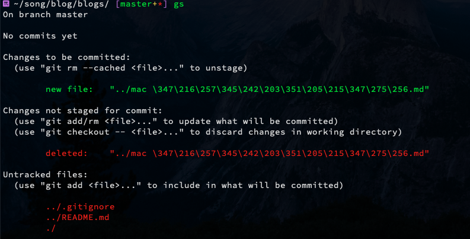

运行 `git status`，中文路径名显示异常，如下图所示

### Git 拥有三个级别的配置文件: 
1. 文件夹中”.git”子文件夹中的 config 文件，最高的优先级，只对所在文档库有效，对应 git config 命令的 --local

2. home 目录中的.gitconfig 文件，优先级次于前者，只对账号登录的用户有效， 对应 git config 命令的 --global

3. Git 程序的安装文件夹中的 etc\gitconfig 文件，优先级最低，对所有登录账号和所有 git 文档库都有效，对应 git config 命令的 --system

### 针对你希望的适用范围选择设置方法
   1. `git config --local core.quotepath false`
   2. `git config --global core.quotepath false`
   3. `git config --system core.quotepath false`
   
   也可以修改对应的配置文件
   
   有时候还需要设置编码方式为 'utf-8'，才能完全显示正常
   eg .修改local配置文件
   编辑代码库 config 文件`vim .git/config` ，增加
   ```plain
   [gui]  
       encoding = utf-8  
   [i18n]  
       commitencoding = utf-8  
   [svn]  
       pathnameencoding = utf-8  
   [core]
       quotepath = false 
   ```
