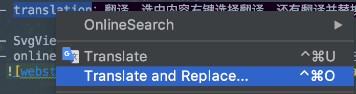
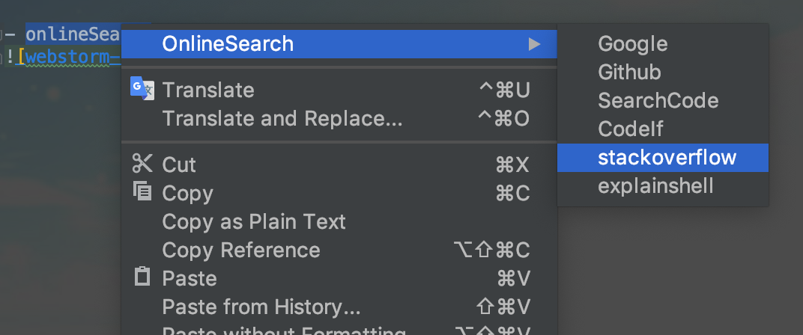
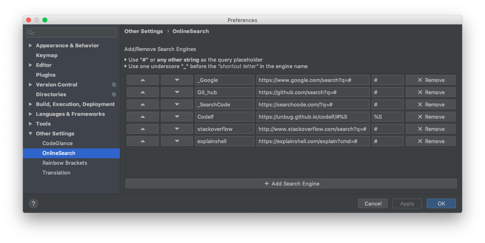
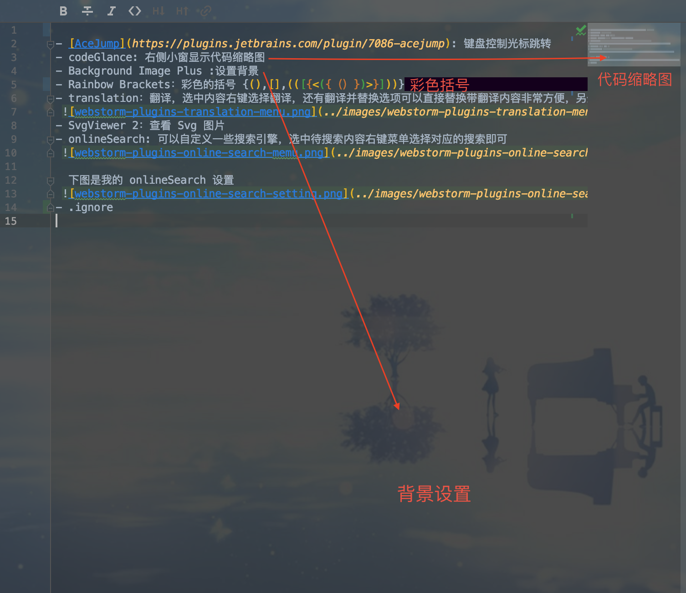

平时写代码用 webStorm 多一些，会用到一些插件来提高工作效率，今天发现查看目录里面的图片不太方便，找了下支持目录显示图片缩略图的插件，顺便整理了一下常用的插件。
- AceJump: 键盘控制光标跳转
  1. 快捷键`⌃ + ;` 输入关键词会在所有的匹配的关键词旁边高亮显示一写字母，输入字母可以使光标跳转的指定位置。
  2. 快捷键 `⇧ + ⌃ + ;` 可以快速跳转到指定行
- codeGlance: 右侧小窗显示代码缩略图
- Background Image Plus :设置背景
- Rainbow Brackets：彩色的括号 {(),[],(([{<({（）})>}]))}
- translation：翻译，选中内容右键选择翻译，还有翻译并替换选项可以直接替换带翻译内容非常方便，另外这两个操作都有对应的快捷键。
 
- SvgViewer 2：查看 Svg 图片
- onlineSearch: 可以自定义一些搜索引擎，选中待搜索内容右键菜单选择对应的搜索即可
 

  下图是我的 onlineSearch 设置
 
- .ignore 
- Image Icon viewer 或 Icon Viewer: 支持在目录中和顶部的标题栏显示图片的缩略图，Icon Viewer支持的图片类型多但是在我这里是无效的，不知道什么原因

最后再补充一张图片吧

